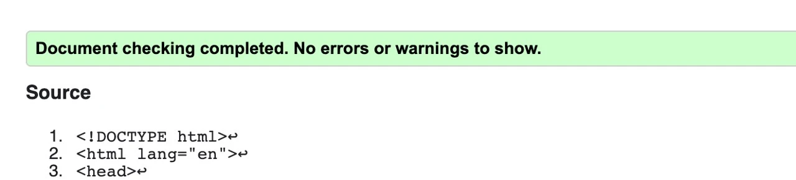
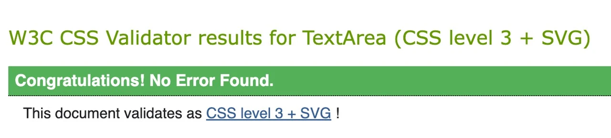
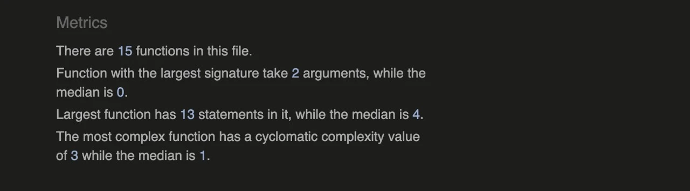

# Road Sign Revision

Road Sign Revision is an interactive learning environment for those who are learning to drive and those looking to test their knowledge of the tricky road signs currently on Irish Roads. it is a fully responsive, mobile and desktop friendly resource which allows users to choose from an array of options for each of the highlighted road signs, which will then provide them with a score and indication of what needs to be improved or celebrated. 

---
## User Stories

### As a new user:
* I would like to know what the application is for in a simplistic and easily understood manner.
* I want to know what my call to action is when I wish to begin the quiz.
* I want the application to be a reliable learning resource that is both functional and intuitive.
* I want the application to be easily operated with conventional functions.
* I want to visit the creators Github and LinkedIn if interested.

### As a returning user:
* I want the application to be simply laid out for revisitation and continual use.
* I want the time to begin the application to be short and not drawn-out so it can be used as a functional and efficient resource.
* I want the option of taking a shorter quiz if time is a restriction or to take a full assessment to validate my knowledge on the subject.
* I want to be able to view the creators Github and LinkedIn if interested.
---
## Home Page Features

- __The Road Sign Revision Logo and Subtitle__
  
  - Existing at the top of the designated quiz container, the Road Sign Revision logo is at the center of the user's attention.
  - The text element below the heading prompts the user to take action and begin the quiz.

- __Main Menu__
  
  - This section houses the buttons in which will begin the quiz according to the user's choice.
  - The user can choose between a 'Full Quiz' or a 'Pop Quiz'.
  - The 'Full Quiz' consists of twenty randomised road signs.
  - The 'Pop quiz' consists of ten randomised road signs.
  - Upon hovering with the mouse, the buttons grow in size and background color darkens slightly to indicate emphasis.

- __Footer__
  
  - Existing at the very bottom of the quiz container, the footer provides users with two external links.
  - Upon pressing the Github icon, the user is brought to my Github profile in a new tab.
  - Upon pressing the LinkedIn icon, the user is brought to my LinkedIn profile in a new tab.
  - When hovering above the icons with the mouse, the icons grow and their color darkens.

## In-Game Features

- __Question Area__
 
  - The question area houses the road sign in which the user is being quizzed.
  - The shown road sign changes depending on the randomised question being shown.
  - The road sign is displayed by a classification that changes the background of the defined area.
  - The question area incorporates a soft box shadow to improve contrast and page readability.

- __Answer Selection__
 
  - The answer selection area displays four possible answers for users to choose from.
  - When the screen width reaches a maximum value the answers will be displayed as a single column of four rather than two columns of two.
  - When an answer is selected the user is shown the correct and incorrect answers.
  - The correct answer will be highlighted in green and the incorrect in red.

- __Next Question__
  
  - The next button brings the user to the next question.
  - The next question will be randomly generated and displayed to the user.
  - The previous answer selection area will be removed with a new one being displayed thereafter.

## End-Game Features

- __End-Game Showcase__
  - The end of game showcase is displayed at the end of the quiz and changes based on the user's score.
  - If a user's score is over 66% the following will occur:
    - The title will display 'Congrats'.
    - The subheading will display 'you're a road sign aficionado'.
    - The picture displayed will be a picture celebrating.

  - If a user's score is under 66% the following will occur:
    - The title will display 'Oops'.
    - The subheading will display 'A little more studying is needed'.
    - The picture displayed will be someone studying.
    - At the bottom of the div the user's score will be presented as the score compared to the possible score.

- __Home Button__
  
  - The home button is presented below the End-Game showcase.
  - It is shown at the end of the quiz to guide the user back to the main menu.

--
## Surface

### Colors
Main colors used in a project:
* Background: rgba(48,43,99,1).
* Font: ##101010 and whitesmoke.
* Headings: #f28500 and rgba(48,43,99,1).

### Fonts 

* Headings: Noto Serif and Oswald, with a backup of Sans-serif.
* Paragraph Elements: Source Sans Pro with a backup of Sans-serif.

---
# Technologies Used

### HTML5

* As a structure language.

### CSS3

* As a style language.

### Javascript

* As a dynamic functionality language.

### Google fonts

* As a font resource.

### Ionicons

* As an icon resource.

### GitHub

* As a software hosting platform to keep project in a remote location.

### Git

* As a version-control system.

### Gitpod

* As a development hosting platform.

### Pixlr

* As an image editor.

---
# Functionality testing 

 I used Chrome dev tools to identify the potential problems in terms of responsive from teh very beginning of this project. This allowed me to plan accordingly and ensure that I used programming principles to avoid an absurd amount of media queries.

 ## Compatibility Testing

 Road Sign Revision was tested on an extensive amount of devices with varying screen heights and widths. I used Chrome, Edge, Safari and Firefox with all of said devices.
 * A list of devices I had at hand to test with physically:
    * 13" Macbook Pro.
    * Gaming PC with 34" screen.
    * Asus Zenbook.
    * iPad Air.
    * iPhone 13 Pro. 
    * Samasung Galaxy Note.
    * iPhone 4s.
* Chrome developer tools was used to ensure Road Sign Revision would work without exception on the obscurest of devices such as the Samsung Galaxy Fold and the Google Nest device.

---
## Bugs Encountered During Development

### Scoreboard Manipulation

The bug I encountered allowed the user to continually press the correct answer as they please and increase the score indefinitely. Initially I managed to disable the correct answer after selected once but if the user selects the correct answer after guessing the wrong answer already, the score will still increase.
To amend this bug I added into the function that targets the array of buttons, to disable every button in option grid when an answer is targeted.

### Responsiveness Inadequacy

Throughout the development process I housed the header above the quiz container however I realised this would be detrimental to the responsiveness of the quiz for mobile devices. 
To fix this I opted for a simplistic design with a housed header element and this in turn, ensured absolute responsivity for the application.

---
## Performance testing

I ran [Lighthouse](https://developers.google.com/web/tools/lighthouse/) tool to perform checks on the performance of the application
The scores were in the high percentile however I had to add meta description keywords and description as I had forgetten to do so after using default boilerplate html.

See the lighthouse performance scores below:

## Code Validation
 
At the and of the project I used three online resources to validate the application's code
 
* [W3C HTML Validator](https://validator.w3.org/) to test HTML code.
* [W3C CSS Validator](https://jigsaw.w3.org/css-validator/) to validate CSS code.
* [JSHint Validator](https://jshint.com) to validate JS code.

See the results below in the same order:

---

 
---

---

___
# Deployment

The Road Sign Revision web application is deployed using GitHub Pages. I used Gitpod as a development environment where I commited all changes to git version control system.
I used push command in Gitpod to save changes into GitHub.

To deploy the website I had to do the following:

* Log in to GitHub and click on repository to deploy ([pp2-roadsignrevision](https://ryanoneill416.github.io/pp2-roadsignrevision/)).
* Select the `Settings` tab and find GitHub Pages option at the bottom of the page.
* From branch select `main` and then `/(root)` as the directory.
* Click `Save` and the website was deployed after refreshing the page and giving github a few moments to process said request.
>  Your site is published at https://ryanoneill416.github.io/pp2-roadsignrevision/

To run locally:
* Log in to GitHub and click on repository to download ([pp2-roadsignrevision](https://ryanoneill416.github.io/pp2-roadsignrevision/)).
* Select `Code` and click Download the ZIP file.
* After this is downloaded, the file can be extracted and ran in your chosen local environment :)

___
# Credits

## Template Usage

 To complete this project I used Code Institute student template: [gitpod full template](https://github.com/Code-Institute-Org/gitpod-full-template)

## Ideas and learning resources:

    * [w3schools.com](https://www.w3schools.com) for learning Arrow Functions in JS.

    * [cssgradient.io](https://cssgradient.io/) for background gradient generation and customisation.

## Irish Road Signs:
* [Official RSA Road Signs](https://ladybirddrivingschool.ie/road-signs-ireland/)

## End-Game Picture Design
* [Pch.vector at Freepik.com](https://www.freepik.com/pch-vector)

